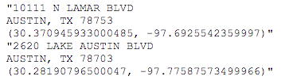

# Wrangling data with Regular Expressions

> THIS IS NOT COMPLETE. IT NEEDS TO BE REWORKED RO WORK BEST AS A MARKDOWN FILE IN VS CODE.

By Christian McDonald. Updated December 2023.

> This is a backup lesson in case the internet is not available. It's designed to presented from the downloaded repo.

A regular expression (regex or regexp for short) is a special text string for describing a search pattern. Searching text with a pattern instead for a specific string of characters can be VERY useful for cleaning data. The concept is available in many programming languages and tools.

## Key concept: patterns

Let's say you have a list of phone numbers in 10-digit format -- 512-555-1212 -- but you want the area code to be in parenthesis: (512) 555-1212. You could do a simple search of the 512 area code followed by a dash 512- and replace it with an area code in parenthesis and a space: (512) .

But what if there are different area codes in the list?

```
512-555-1211
301-333-1212
404-123-1213
```

With regular expressions, you can search for a pattern of characters. Instead of searching just for 512-, you can look for "three numbers together at the beginning of a line that are then followed by a dash".

If you capture that matching pattern as a group, you can then replace that group with parenthesis outside it, no matter what the contents of the group. If that saved group is called $1 then you can replace it with ($1)  and it doesn't matter if $1 is equal to 512- or 301-.

## Special characters, commands and escape

Let's touch quickly on the syntax of regular expressions. Don't get hung up if these sound like gibberish, because it will make sense more when we start using it. Your Regex Cheat Sheet (or this alternative) comes in handy here.

Regular expressions use special characters to do special things, like match the beginning of a line. These commands are called tokens:

^ will find the beginning of a line.

* will find "zero or more" of whatever precedes it.

Regular expressions use the backslash (the one above return on a keyboard where the top tips to the left) with other characters to create more tokens to do special things:

\d will find any number character (or digit).

\D will match anything other than a number.

\t is a tab character, because hitting the tab on the keyboard will perform the action instead of giving you the character.

But then sometimes, you actually need to find the character ^, and not use it as a command. Regular expressions use the \ to give the literal expression of a character that would otherwise be a token:

\* will find the asterisk character instead of modifying the query to find "zero or more".

## Defining our goal

We're going to use regular expressions to take split complicated address data into individual parts. Let's talk about the data first. Many government agencies use Socrata as their open data portal: From Austin to Boston; from Los Angeles to New York.

Some of the data sets in Austin have all the address parts crammed into a single field. Regex can easily explode that into individual columns.

So, our goal is to turn this:

```
"10111 N LAMAR BLVD
AUSTIN, TX 78753
(30.370945933000485, -97.6925542359997)"
"2620 LAKE AUSTIN BLVD
AUSTIN, TX 78703
(30.28190796500047, -97.77587573499966)"
"14016 N FM 620 RD
```

into this:

```

```

## The goal in a nutshell

We are building a pattern in our regular expression field, creating a group to capture each part of the address that we want to keep. We'll continue the pattern outside the group until we get to the next part we want to keep, when we'll create a new group, and so on.

You'll want to reference your [Regex Cheat Sheet(https://drive.google.com/file/d/0B8ConnGcXrv8MzE3SWtwU2NxQk0/view?usp=sharing)] (or [this alternative](https://drive.google.com/file/d/0B8ConnGcXrv8MzE3SWtwU2NxQk0/view?usp=sharing)).

Let's get started:

1. View the file socrata_addresses.txt and copy and paste the contents into the "TEST STRING" of regex101.com.
2. Note this is just one column from a larger Socrata data set of restaurant inspection scores in Austin, TX. (When I want to clean a single column of data, I often download the data and will just copy out one column into my text editor and work it before pasting back the results into Excel, carefully making sure they still line up.)
3. Let's look at our data a little closer. This is really rows of data, even though there are six lines of text here:

    

Notice the address, city, state, zip, latitude and longitude are all in the same "cell" (what is inside the quote marks), but the content of the cell has returns in it. We want to split these six distinct pieces into their own columns for each record. Why? Many reasons, but one is to use the latitude and longitude for data visualizations.
We will build a Regular Expression pattern to search and capture six groups of text and then replace those groups with tabs between them so we can put them back into Excel as columns.
In regex101, in the right-hand box of the REGULAR EXPRESSION string, make sure there is a green /gm listed. If not, click on the / and choose the first two options “global” and “multiline” 
Capturing the address
We know that the first line starts at the beginning of the line, so we can start with this token, which signifies that: ^
Now, in the end, we don't want to keep the double-quote, so we won't put it inside a group. We'll just add it to the pattern: ^".
Take note for a minute at the number of matches at the top right: There are 325 matches, and that is how many records we should end up with. You'll want to keep referring back to that and making sure you have 325 groups.


Next, we'll start our first capture group with parenthesis: ^"(). You'll see as you type in the first parentheses, regex101 might also put in the second and then put your cursor in the middle of them. This is "code completion", and good code editors do this to help you be more efficient. (If not, no big deal … just add it.)
Inside the parenthesis (our first group), we want to capture the whole address, which is everything until the end of the line. The period token . means "any character", and * means "zero or more", so put these together and we get everything: ^"(.*).

Let's take a minute to explain more about Regex101 and how it helps you.


Each matching group gets a color, and the contents of the match is shown in MATCH INFORMATION. The EXPLANATION section tells you exactly how each token is used, and the 	QUICK REFERENCE section is a list of tokens you can use, more in depth than the cheat sheet I've started you with.

OK .. on with it.

Before we can start capturing the second group with the city, we need to add the return to the pattern so it can start recognizing the next line. But here's the drive-you-crazy thing: Windows and Macs treat these differently. On a Mac, \n is a "new line". If you are on a Windows machine, you'll need to use \R. The regex101 editor will recognize either, but later when we do the search and replace in your code editor, you have to use the character that works with your operating system. This tutorial will use Macs, so: ^"(.*)\n.
(If we end up with PC's in this lab, you'll need to use \R every time you see \n in this tutorial.)
Sanity check: This what your screen should look like:


Capturing the city
Now, let's grab the city. As we look through the list, we can see there is more than Austin, and some of these names have spaces so we can't find just letters alone. There are MANY ways to do this, but we'll do it here by creating a group first:  ^"(.*)\n().
Then inside the group we'll put a token that looks for word characters:  ^"(.*)\n(\w).
Then we'll add the quantifier + to find "one or more" of what's in the character set:   ^"(.*)\n(\w+).
Make sure we are capturing all 325 groups. We should be good.
Capturing the state
These are all the same, all in TX, so we don't really have to save it at all, but we will. We'll use this to remind ourselves that you can also just match a string literally. First we put the comma and space outside the second group, since we don't want to keep it:    ^"(.*)\n(\w+), .
Catching errors
Now, take a moment and check how many matching groups we have. Wait ... WHOA ... we have only 314. What could've gone wrong?
Scroll down the Test string until you find something amiss. The colors help you spot problems easily.


What is the difference between the working lines and the ones that aren't? Something about the city.
BEE CAVE and WEST LAKE HILLS have spaces while AUSTIN and PFLUGERVILLE do not. It looks like our city group did not capture a needed space, which wasn't really revealed until we tried to carry out the pattern with the ,  that is found after the city. This happens, a lot  … we need to back up and fix the error.
Right now, our expression is this: ^"(.*)\n(\w+),  and the part that captures the city is (\w+). We need to use something called a "character set"  that allows us to include more than one token within a group. We signify this by putting what we want inside of square brackets: So we need to put the \w inside square brackets along with the space so we can catch both: ^"(.*)\n([\w ]+), .
Back to the state
Then we create our third group with TX inside it:   ^"(.*)\n([\w ]+), (TX). We are looking for the literal text TX because there are no other states in this data set. We can't skip it because we need the pattern to continue.

Sanity check. Here is what you should have:


Capturing the ZIP
Again, we don't want to keep the space between the state and ZIP, so we'll put it outside the third group, and start our fourth one for ZIP: ^"(.*)\n([\w ]+), (TX) ().
All of these zip codes are of the 5-digit variety, so this can be less complicated than it might be with 9-digit ZIPs. Again, there are many ways to do this, but we'll use \d for the numbers and * to capture zero or more of them: ^"(.*)\n([\w ]+), (TX) (\d*).
Complete the pattern for this line with the new line token: ^"(.*)\n([\w ]+), (TX) (\d*)\n.

Sanity check: This is where we are …


Capturing latitude
We don't want to keep the parenthesis that starts this last line, so we'll put it outside a group. However, since parenthesis mean something special in regex, we need to escape it with a backslash so it will find the character and not start the new group: ^"(.*)\n([\w ]+), (TX) (\d*)\n\(. Code completion might make this tricky, but you can do it!
Now we can start our new group, so go ahead and add the beginning and end parentheses: ^"(.*)\n([\w ]+), (TX) (\d*)\n\(().
Inside our fifth group, we need numbers and the decimal point. We will create a character set using square brackets and put inside it \d for numbers and \. for the decimal point, which we have to escape since . means "any character". We finish it off by using + to look for one or more of the characters in the set. Like this:
^"(.*)\n([\w ]+), (TX) (\d*)\n\(([\d\.]+).
Capturing longitude
We don't need the comma and space in our next group, so we put it outside to keep the pattern going: ^"(.*)\n([\w ]+), (TX) (\d*)\n\(([\d\.]+), .
We can get the longitude like we did latitude, but we have to add the hyphen to the character set. So, create the group:
^"(.*)\n([\w ]+), (TX) (\d*)\n\(([\d\.]+), ().
Add the character set:
^"(.*)\n([\w ]+), (TX) (\d*)\n\(([\d\.]+), ([]).
And inside of it, put \d for digits, \- for the hyphen and \. for the decimal point:
^"(.*)\n([\w ]+), (TX) (\d*)\n\(([\d\.]+), ([\d\-\.]).
Add our quantifier to get one or more:
^"(.*)\n([\w ]+), (TX) (\d*)\n\(([\d\.]+), ([\d\-\.]+).
Because the trailing parentheses and quote are at the end of a line, we could ignore them, but we won't. We'll add them to the end of the pattern, escaping the close parentheses just to be sure:
^"(.*)\n([\w ]+), (TX) (\d*)\n\(([\d\.]+), ([\d\-\.]+)\)".


You have it all! 325 matches into 6 different groups.
The substitution string
Now that we have a pattern with our six groups of data, we can substitute them in any order we want using a search and replace, and we can build our substitution string right here in Regex101 as well.

In the left-hand navigation under the FUNCTION heading, click on the item called Substitution. That should expand the SUBSTITUTION window.


Now we can build a substitution string, and we can see the cleaned data in the window below.

Our goal with the substitution string is to pull back our six groups, but to put tabs in between each of them. If we can build a search and replace like this, then we can paste the result back into Excel, and each group will become its own column.

A quick refresher from our intro: Once we've built a group, we can reference it in our substitution string by order in which we captured it. So, if we want to reference our first group, we use this: $1. Put that in the SUBSTITUTION string box, like this:


You can see that Regex101 is now pulling back our address.
We can't just type a tab key after our group because they keyboard command will move us to another box, so we use the token for tab, which is \t. So, add that to the end of our substitution string to get this: $1\t. You'll see space get added into our substitution example.
Now we can add our next ordered group to our substitution string and see our city get added on: $1\t$2.

Here is a sanity check:


Now that you see how it works, let's go ahead and add the rest of the groups, all with tabs in between them: $1\t$2\t$3\t$4\t$5\t$6. Your screen might look a little different than below if the lines start wrapping.


Now, you might try copy 'n' pasting this result into Excel or Google Sheets and it will become six distinct columns.
Limitations of regex101
This can work fine for a small data set, but things bog down on the site if you have many rows or columns of data. I often use regex101 with sample text to figure out my patterns, but then use them in a text editor or within a R or Python script. You can see how to use regex in Find/Replace for various text editors below.

You can actually save this example in regex101 under SAVE & SHARE in the top left panel. If you create a login with regex101 you can keep a dashboard of them.

My example is saved here: https://regex101.com/r/dVFG6T/2/

> Reporting with Data students can stop here and save your regex101 link and submit it in Canvas. I’ll demo the rest in class.
Search and replace in the text editor
We are almost done. Go ahead and launch your text editor if you haven't already. I’ll show this first in Visual Studio Code.

Take your TEST STRING data (not the expression, but the data) and paste it into a new next file in your text editor. (Or grab it from the file you downloaded.)
Go under the Edit menu to Replace (or do control-H for PC, command-option-F for Mac) to bring up the search window.
Copy the Regular Expression pattern you built in Regex101 and insert into the Find text field in VS Code.
Copy the Substitution pattern and insert it into the Replace field.
Click on the button on the far-right of the Find line, the one that has .* in it.


Here is what the search and replace screen looks like in VS Code:


Now, hit the "Replace All" button to the far-right of the Replace field and watch the magic happen.
Once you run the search and replace, you can copy and paste the results into a spreadsheet and it will be six distinct columns. (If it doesn't, hollar.)


More Regex
There are lots of sites and tutorials on regular expressions, but http://www.regular-expressions.info/ is one of my favorites.

And remember, if you are stumped by something, chances are you are not the first. Google and Stack Overflow are your friends. ChatGPT might be helpful, too, if you are good at prompts.

